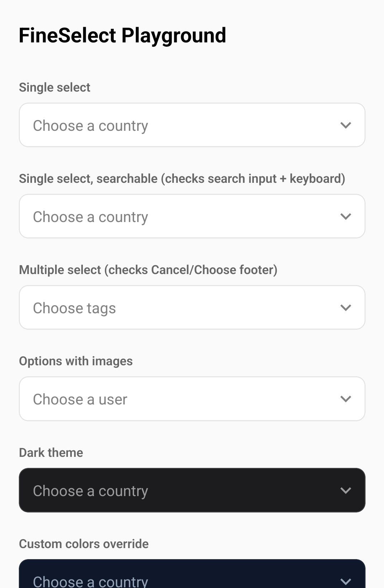
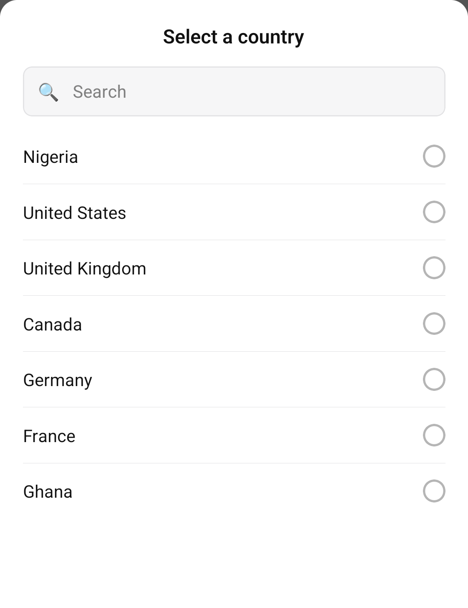
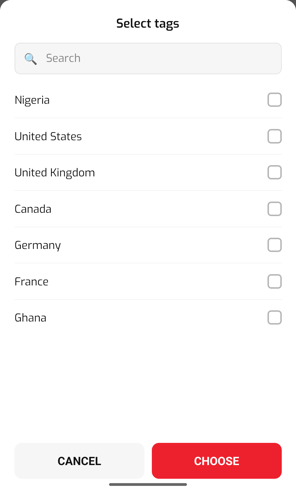

# react-native-fine-select

A themeable single/multiple select (dropdown) component for React Native. Renders as a bottom-sheet picker with search, optional per-option image/icon, and light/dark theming.

<p>
  
  
  
</p>

## Install

```sh
npm install react-native-fine-select
```

`react` and `react-native` are peer dependencies and must already be present in your project.

## Usage

### Single select

```tsx
import React, { useState } from 'react';
import FineSelect, { FineSelectOption } from 'react-native-fine-select';

const countries: FineSelectOption[] = [
  { label: 'Nigeria', value: 'ng' },
  { label: 'United States', value: 'us' },
  { label: 'United Kingdom', value: 'uk' },
];

const Example = () => {
  const [country, setCountry] = useState<FineSelectOption | null>(null);

  return (
    <FineSelect
      data={countries}
      value={country}
      onChange={setCountry}
      title="Select a country"
      placeholder="Choose a country"
    />
  );
};
```

### Multiple select

```tsx
const [tags, setTags] = useState<FineSelectOption[]>([]);

<FineSelect
  multiple
  data={tags}
  value={tags}
  onChange={setTags}
  title="Select tags"
/>;
```

For `multiple`, the Cancel/Choose footer is shown so selections only apply when the user taps Choose. For single select, tapping an option applies it immediately and no footer is shown.

### Options with an image or icon

```tsx
const users: FineSelectOption[] = [
  { label: 'Ada Lovelace', value: 'ada', imageUrl: 'https://example.com/ada.png', other: '@ada' },
  { label: 'Alan Turing', value: 'alan', imageIcon: <MyIcon name="user" /> },
];
```

### Dark theme

```tsx
<FineSelect data={countries} value={country} onChange={setCountry} theme="dark" />
```

### Fully custom colors

Don't like the built-in light/dark palettes? Override any token — the rest fall back to the base `theme`:

```tsx
<FineSelect
  data={countries}
  value={country}
  onChange={setCountry}
  colors={{ background: '#0F172A', text: '#F8FAFC', border: '#1E293B' }}
/>
```

### Custom font

Pass a single family name to apply it everywhere:

```tsx
<FineSelect data={countries} value={country} onChange={setCountry} fontFamily="Poppins-Regular" />
```

Android ignores `fontWeight` on custom (non-system) typefaces, so a single family name renders every role — title, buttons, item text — at the same weight. If your font ships separate files per weight, pass an object instead so each role picks up the right one:

```tsx
<FineSelect
  data={countries}
  value={country}
  onChange={setCountry}
  fontFamily={{
    regular: 'Poppins-Regular', // item text, search input, trigger text, empty state
    medium: 'Poppins-Medium', // sheet title (falls back to `regular` if omitted)
    bold: 'Poppins-Bold', // Cancel/Choose footer buttons (falls back to `regular` if omitted)
  }}
/>
```

### Custom search/caret icons

The built-in search glyph and trigger caret are drawn with plain Views (no icon-library dependency). Swap in your own if you already use an icon set:

```tsx
<FineSelect
  data={countries}
  value={country}
  onChange={setCountry}
  searchable
  searchIcon={<Feather name="search" size={18} color="#808080" />}
  caretIcon={<Feather name="chevron-down" size={18} color="#808080" />}
/>
```

### Controlled open state (no trigger)

```tsx
<FineSelect
  data={countries}
  value={country}
  onChange={setCountry}
  hideTrigger
  open={isOpen}
  onOpenChange={setIsOpen}
/>
```

## Props

| Prop | Type | Default | Description |
| --- | --- | --- | --- |
| `data` | `FineSelectOption[]` | `[]` | Options to render. |
| `value` | `FineSelectOption \| null` (single) or `FineSelectOption[]` (multiple) | - | Current selection. |
| `onChange` | `(value) => void` | - | Called with the new selection. |
| `multiple` | `boolean` | `false` | Enables multi-select and the Cancel/Choose footer. |
| `title` | `string` | `'Select'` | Sheet header text. |
| `placeholder` | `string` | `'Choose'` | Trigger text when nothing is selected. |
| `searchable` | `boolean` | `false` | Shows the search input. |
| `searchPlaceholder` | `string` | `'Search'` | Search input placeholder. |
| `searchIcon` | `React.ReactNode` | built-in glyph | Custom search icon. |
| `caretIcon` | `React.ReactNode` | built-in chevron | Custom trigger indicator icon. |
| `colorTheme` | `string` | `'#ED212D'` | Accent color for the selection indicator and Choose button. |
| `theme` | `'light' \| 'dark'` | `'light'` | Base color scheme of the trigger and sheet. |
| `colors` | `Partial<FineSelectColors>` | - | Overrides individual color tokens (background, text, border, overlay, etc.) on top of `theme`. |
| `fontFamily` | `string \| { regular?, medium?, bold? }` | system font | Font applied to text in the trigger and sheet. A string applies everywhere; an object lets each weight/role use a different family (see below). |
| `style` | `StyleProp<ViewStyle>` | - | Style applied to the trigger. |
| `hideTrigger` | `boolean` | `false` | Hides the built-in trigger; drive the sheet with `open`/`onOpenChange`. |
| `open` | `boolean` | `false` | Opens the sheet when set to `true`. |
| `onOpenChange` | `(open: boolean) => void` | - | Called when the sheet opens/closes. |
| `disabled` | `boolean` | `false` | Disables the trigger. |
| `emptyText` | `string` | `'No results found'` | Text shown when the search has no matches. |
| `closeOnBackdropPress` | `boolean` | `true` | Closes the sheet when tapping outside it. |

## FineSelectOption

```ts
interface FineSelectOption {
  label: string;
  value: string;
  imageUrl?: string;
  imageIcon?: React.ReactNode;
  other?: string;
}
```

## License

MIT
